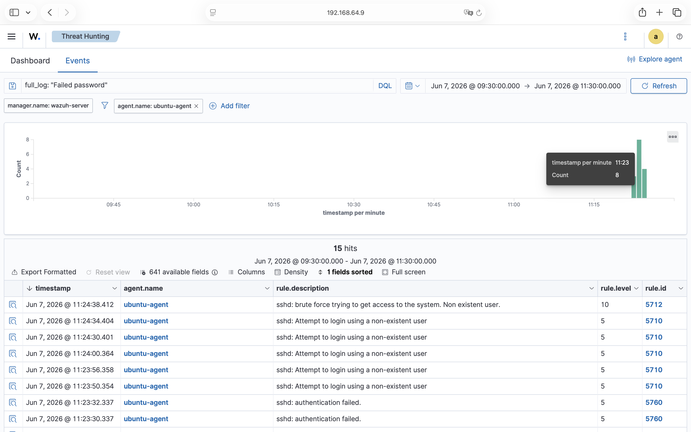
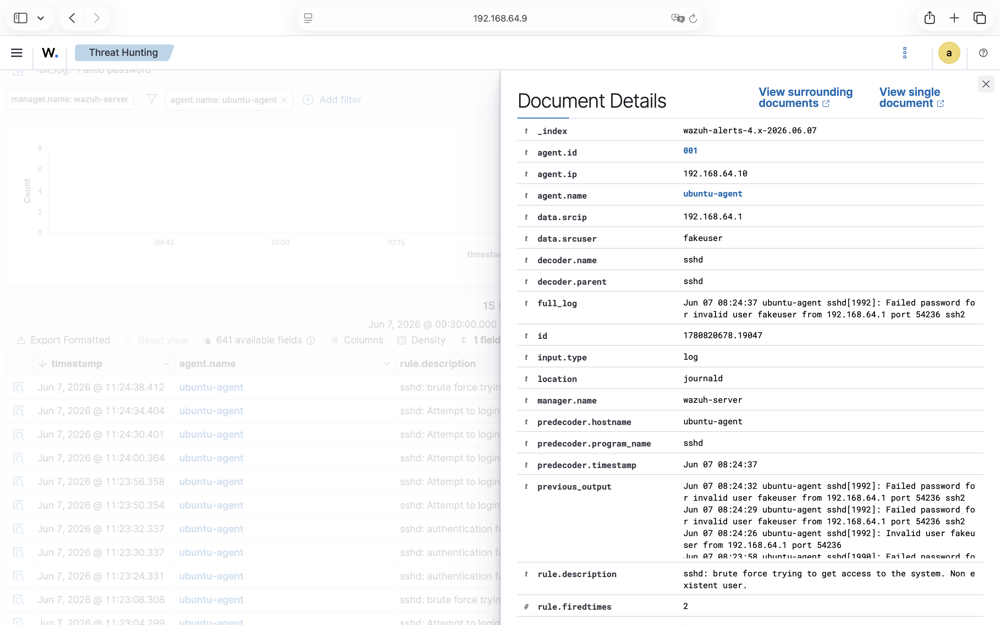
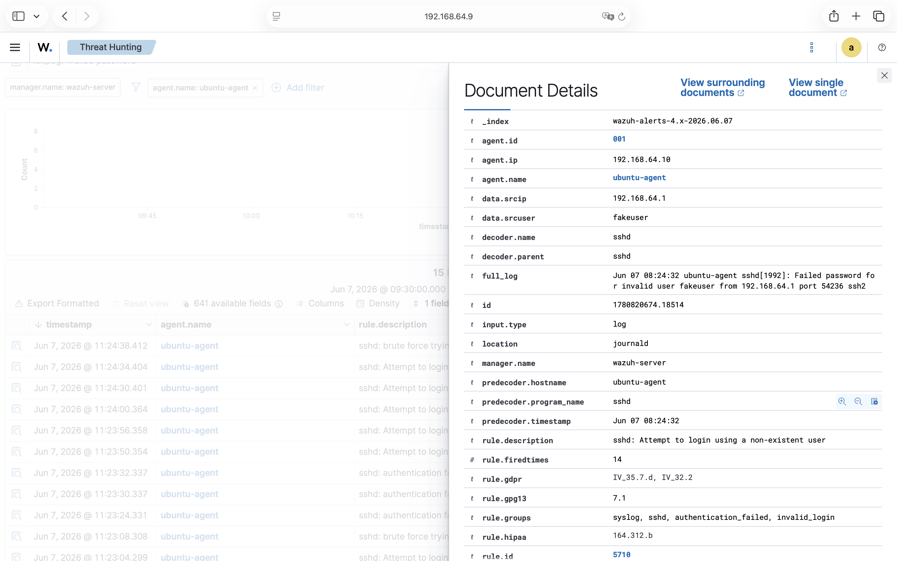
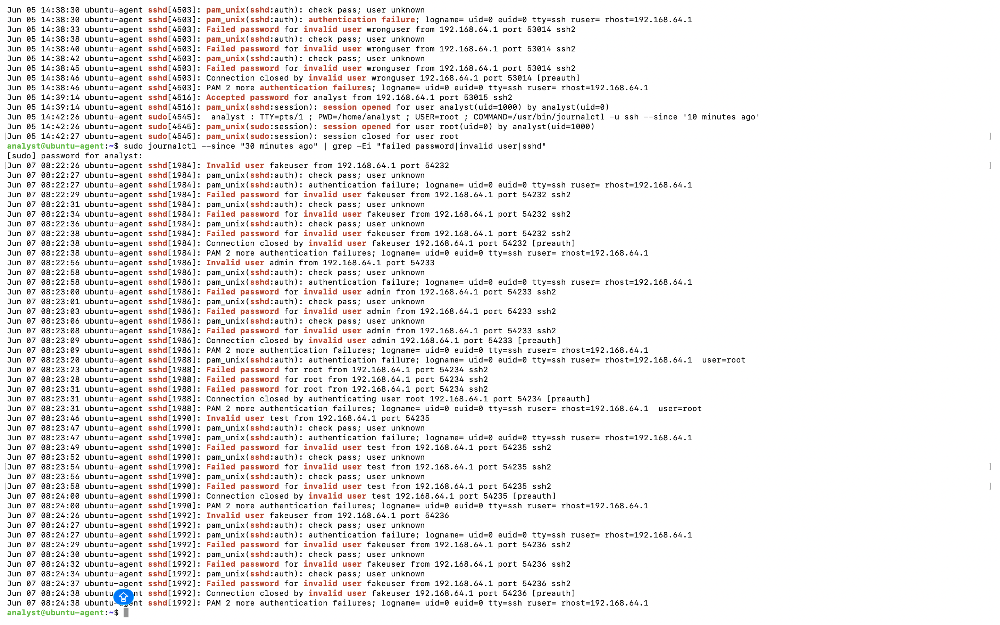

# Lab 010 - Repeated Failed SSH Login Triage from Same Source IP

## Executive Summary

This lab documents the triage of repeated failed SSH login attempts observed in Wazuh from the same source IP address.

A filtered Wazuh search for `full_log: "Failed password"` returned 15 failed SSH password events from the monitored Ubuntu agent. The failed authentication attempts originated from the same source IP address and targeted multiple usernames, including `fakeuser`, `admin`, `root`, and `test`.

Wazuh generated individual SSH authentication failure alerts and also produced a higher-severity brute-force alert under rule ID `5712`.

This activity was generated in a controlled lab environment and was not treated as a confirmed security incident. However, in a production environment, the same pattern could indicate SSH brute-force activity, credential guessing, or an unauthorized access attempt.

---

## Objective

The objective of this lab was to triage repeated failed SSH login attempts from the same source IP address using Wazuh.

The investigation focused on:

- identifying repeated failed SSH password events
- confirming whether the events came from the same source IP
- reviewing targeted usernames
- checking Wazuh rule IDs and severity levels
- identifying whether Wazuh generated a brute-force alert
- validating the SIEM evidence against raw Linux authentication logs
- making a basic L1 SOC triage decision

---

## Environment / Data Source

Host: `ubuntu-agent`  
Agent IP: `192.168.64.10`  
Wazuh server: `wazuh-server`  
Source IP: `192.168.64.1`  
Tool: Wazuh Threat Hunting  
Log source: `journald` / SSH authentication logs  
Search filter: `full_log: "Failed password"`  
Time window: Jun 7, 2026 @ 09:30 - Jun 7, 2026 @ 11:30  

---

## Observed Activity

A Wazuh Threat Hunting search was performed using the following filter:

`full_log: "Failed password"`

The search returned 15 failed SSH password events from the monitored Ubuntu agent.

The failed login attempts were associated with the same source IP address:

`192.168.64.1`

The activity targeted multiple usernames, including:

- `fakeuser`
- `admin`
- `root`
- `test`

The repeated failed SSH authentication pattern was observed on the monitored host:

`ubuntu-agent`

This activity indicates repeated unsuccessful SSH authentication attempts from the same source IP address within the selected time window.

In this lab, the activity was intentionally generated in a controlled environment. In a real production environment, the same pattern would require review because it may indicate brute-force activity, credential guessing, or an unauthorized login attempt.

---

## Evidence

### Evidence 1 - Filtered Wazuh Failed Password Events

The Wazuh Threat Hunting search filter `full_log: "Failed password"` returned 15 failed SSH password events from the monitored Ubuntu agent.



---

### Evidence 2 - Brute-Force Alert Detail

Wazuh generated a higher-severity brute-force alert after repeated failed SSH authentication attempts were observed.

The brute-force alert contained the following key fields:

```text
agent.name: ubuntu-agent
agent.ip: 192.168.64.10
data.srcip: 192.168.64.1
data.srcuser: fakeuser
decoder.name: sshd
location: journald
rule.id: 5712
rule.level: 10
rule.description: sshd: brute force trying to get access to the system. Non existent user.
```



---

### Evidence 3 - Single Failed Password Alert Detail

An individual failed SSH password event was also reviewed to confirm the source IP, targeted username, and raw log content.

Example alert fields:

```text
agent.name: ubuntu-agent
agent.ip: 192.168.64.10
data.srcip: 192.168.64.1
data.srcuser: fakeuser
decoder.name: sshd
location: journald
rule.id: 5710
rule.description: sshd: Attempt to login using a non-existent user
full_log: Failed password for invalid user fakeuser from 192.168.64.1
```



---

### Evidence 4 - Raw Linux Log Verification

The Wazuh alert evidence was validated against the raw Linux logs on the Ubuntu agent.

The following command was used:

```bash
sudo journalctl --since "30 minutes ago" | grep -Ei "failed password|invalid user|sshd"
```

The raw logs confirmed repeated failed SSH password attempts from the same source IP address.

Example observed raw log patterns:

```text
Failed password for invalid user fakeuser from 192.168.64.1
Failed password for invalid user admin from 192.168.64.1
Failed password for root from 192.168.64.1
Failed password for invalid user test from 192.168.64.1
```



---

## Analysis

The observed activity shows repeated failed SSH password attempts from the same source IP address, `192.168.64.1`, against the monitored host `ubuntu-agent`.

The attempts targeted multiple usernames, including non-existent users and the privileged `root` account. This increases the suspicion level because attackers often try common usernames during SSH brute-force or credential guessing attempts.

Wazuh first generated individual authentication-related alerts, such as non-existent user login attempts and SSH authentication failures. After repeated failed login activity was observed, Wazuh also generated a higher-severity brute-force alert under rule ID `5712`.

The activity was confirmed in both Wazuh and the raw Linux `journalctl` logs. This confirms that the SIEM alert evidence matched the original host-level authentication logs.

In this lab, the activity was intentionally generated in a controlled environment. Therefore, it was not treated as a confirmed security incident. However, in a production environment, the same pattern would require further investigation.

Possible explanations include:

- controlled lab-generated testing
- user error or misconfiguration
- unauthorized SSH brute-force attempt
- credential guessing against common usernames
- exposed SSH service being targeted

---

## Risk

The main risk is unauthorized SSH access through credential guessing or brute-force activity.

If an attacker successfully authenticates, they may gain interactive access to the host. This could lead to command execution, privilege escalation, persistence, data access, or lateral movement.

The presence of a `root` login attempt increases the risk because privileged account targeting may indicate malicious intent.

---

## Recommended Next Steps

Recommended next steps in a real environment:

- Confirm whether the source IP address is internal, trusted, or expected.
- Check whether the targeted usernames exist on the system.
- Review whether any successful SSH login occurred after the failed attempts.
- Review session activity after any successful login.
- Check for repeated attempts over a longer time window.
- Apply SSH hardening if needed.
- Consider blocking or rate-limiting the source IP if unauthorized.
- Escalate the alert if the activity is external, unexpected, repeated, or followed by successful authentication.

---

## MITRE ATT&CK Mapping

Technique: `T1110 - Brute Force`  
Tactic: `Credential Access`

This mapping is relevant because the observed activity involved repeated failed SSH authentication attempts that may indicate credential guessing or brute-force behavior.

---

## Final SOC Summary

Multiple failed SSH login attempts were observed from source IP `192.168.64.1` against the monitored host `ubuntu-agent`. A Wazuh search using `full_log: "Failed password"` returned 15 failed SSH password events. The attempts targeted multiple usernames, including `fakeuser`, `admin`, `root`, and `test`. Wazuh generated individual authentication failure alerts and also produced a higher-severity brute-force alert under rule ID `5712`. The activity was validated against raw Linux authentication logs using `journalctl`. This was controlled lab activity, but in a production environment, the pattern would require escalation if it was unauthorized, external, persistent, or followed by successful authentication.

---

## Lessons Learned

This lab helped reinforce how repeated SSH authentication failures appear in Wazuh and how individual failed login events can lead to a higher-severity brute-force alert.

Key lessons learned:

- Filtering by `full_log: "Failed password"` helps isolate SSH failed password activity.
- Repeated failed SSH attempts from the same source IP may indicate brute-force activity.
- Multiple targeted usernames increase the suspicion level.
- Attempts against `root` should be reviewed carefully.
- Wazuh can correlate repeated failed authentication attempts into a higher-severity alert.
- Raw Linux logs should be used to validate SIEM alert evidence.
- Source IP, targeted username, rule ID, rule level, timestamp, and full log content are essential for L1 SOC triage.

---

## SOC English Sentences

Multiple failed SSH login attempts were observed from the same source IP.

The activity targeted multiple usernames within a short time window.

The source IP was identified as `192.168.64.1`.

Wazuh generated a brute-force alert under rule ID `5712`.

The alert was validated against raw Linux authentication logs.

This activity was generated in a controlled lab environment.

In a production environment, this pattern would require escalation if unauthorized or followed by successful authentication.

