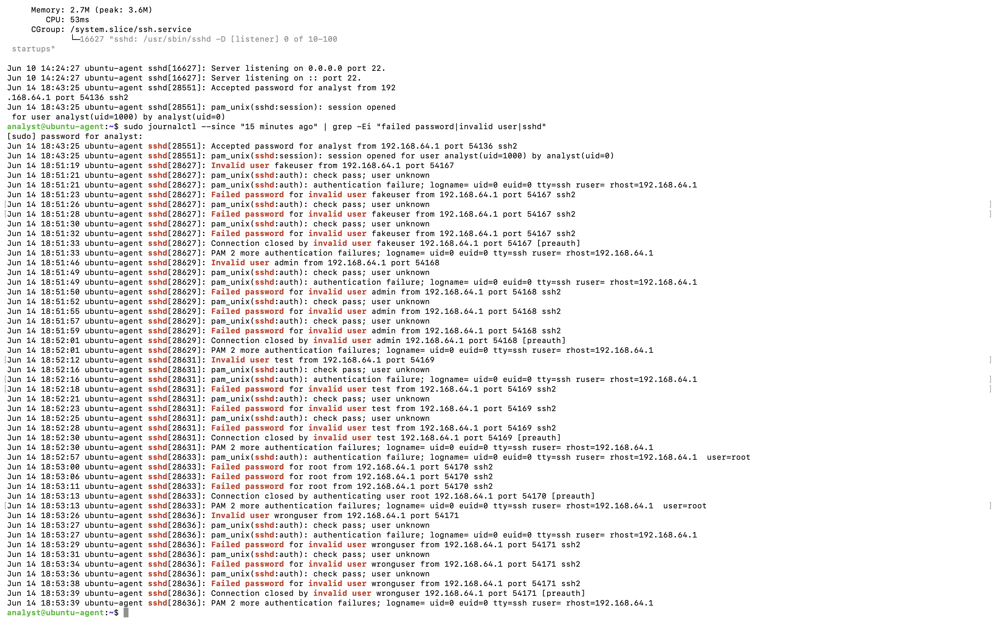
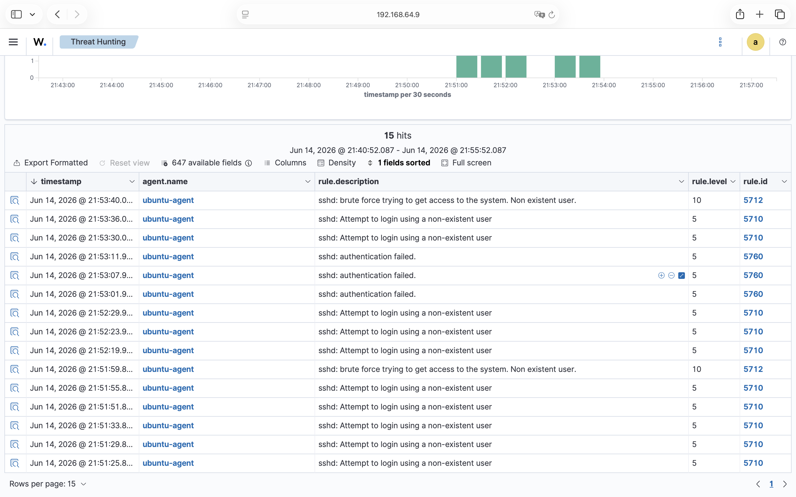
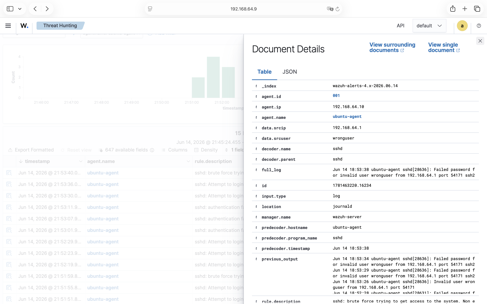

# Lab 011 - Wazuh SSH Brute-Force Alert Deep Triage

## Executive Summary

This lab documents the investigation of a Wazuh SSH brute-force alert generated after repeated failed SSH authentication attempts against a monitored Ubuntu endpoint.

The objective was to move beyond basic event observation and perform field-level SIEM alert triage. The investigation reviewed raw Linux authentication logs, the Wazuh Threat Hunting alert list, and the expanded alert fields in Document Details.

The reviewed activity was generated in a controlled lab environment. This lab was handled as a SOC analyst training exercise and was not treated as a confirmed compromise.

---

## Objective

The objective of this lab was to investigate a Wazuh SSH brute-force alert and understand how repeated failed SSH login activity is represented inside a SIEM.

The lab focused on answering the following questions:

- What was observed?
- Where was it observed?
- Which user, host, IP address, or rule was involved?
- Why is the activity suspicious?
- What evidence supports the alert?
- What is the possible risk?
- What should be done next?
- Should it be escalated?

---

## Environment / Data Source

Host: ubuntu-agent  
Agent ID: 001  
Agent IP: 192.168.64.10  
Wazuh server: wazuh-server  
Source IP: 192.168.64.1  
Tool: Wazuh  
Log source: journald / sshd authentication logs  
Alert type: SSH brute-force related alert  

---

## Observed Activity

Repeated SSH failed authentication attempts were observed against the monitored Ubuntu endpoint.

The activity originated from source IP `192.168.64.1` and targeted invalid or non-existent users, including `wronguser`.

Wazuh displayed related SSH authentication events in Threat Hunting and generated Rule `5712` brute-force related alerts during the reviewed time window.

The alert was opened in Document Details and reviewed at field level to identify the affected host, source IP address, targeted username, decoder, full log evidence, and previous related failed attempts.

---

## Evidence

### Raw Linux Authentication Logs

The following command was used on the Ubuntu agent to review raw SSH authentication activity:

    sudo journalctl --since "30 minutes ago" | grep -Ei "Failed password|Invalid user|sshd"

The raw Linux authentication logs showed repeated failed SSH login attempts from source IP `192.168.64.1` against the monitored Ubuntu agent.

---

### Wazuh Alert List and Related Events

The Wazuh Threat Hunting view showed related SSH authentication events during the reviewed time window.

The event list included Rule `5712` brute-force related alerts and related authentication failure events. This supported the conclusion that the activity was not a single isolated failed login attempt, but a repeated SSH authentication pattern.

---

### Expanded Alert Fields

The Rule `5712` alert was opened in Document Details and reviewed field by field.

| Field | Value |
|---|---|
| Agent ID | 001 |
| Agent IP | 192.168.64.10 |
| Agent name | ubuntu-agent |
| Source IP | 192.168.64.1 |
| Source user | wronguser |
| Decoder name | sshd |
| Location | journald |
| Manager name | wazuh-server |
| Rule ID | 5712 |
| Rule level | 10 |
| Rule description | sshd: brute force trying to get access to the system. Non existent user. |

The `full_log` field showed a failed SSH login attempt for invalid user `wronguser` from source IP `192.168.64.1`.

The `previous_output` field showed multiple related failed SSH authentication attempts before the brute-force alert was generated. This field is important because it shows that Wazuh correlated repeated activity rather than treating the event as a single isolated login failure.

---

## Analysis

The reviewed activity was not treated as a single failed login event. Multiple failed SSH authentication attempts were observed from the same source IP address.

Wazuh correlated this repeated failed authentication activity into a brute-force related alert under Rule ID `5712`.

The activity is suspicious because repeated SSH authentication failures from the same source IP may indicate password guessing, brute-force activity, credential stuffing, or attempted unauthorized access.

The expanded alert fields showed that the affected host was `ubuntu-agent`, the source IP was `192.168.64.1`, and the targeted invalid user was `wronguser`.

The `previous_output` field provided supporting evidence that several related failed SSH attempts occurred before the alert was generated.

Because this activity was generated in a controlled lab environment, it was documented as simulated suspicious authentication activity rather than a confirmed attack.

---

## Risk

Repeated failed SSH login attempts may indicate an attempt to gain unauthorized access to a system.

Possible risks include:

- unauthorized SSH access
- compromised credentials
- successful login after repeated password guessing
- lateral movement after access
- privilege escalation after initial access
- persistence using valid credentials

The risk would increase if a successful login occurred shortly after the brute-force activity.

---

## Recommended Next Steps

- Review all failed SSH authentication events from the same source IP.
- Check whether any successful SSH login occurred after the failed attempts.
- Identify all targeted usernames.
- Confirm whether the source IP is expected or unauthorized.
- Review the affected host for unusual session activity.
- Check for sudo usage or privilege escalation after login.
- Block or restrict the source IP if the activity is unauthorized.
- Escalate if a successful login follows the brute-force activity.

---

## Escalation Decision

This alert should be escalated if one or more of the following conditions are observed:

- a successful SSH login after repeated failed attempts
- activity from an external or unknown source IP
- attempts against privileged users such as `root` or `admin`
- unusual commands or sudo activity after login
- repeated alerts from the same source IP
- activity affecting production systems

In this lab, no confirmed compromise was identified based only on the reviewed evidence. However, the alert should still be documented and investigated because brute-force activity may lead to unauthorized access.

---

## MITRE ATT&CK Mapping

| Tactic | Technique | Technique ID |
|---|---|---|
| Credential Access | Brute Force | T1110 |

This mapping is relevant because the observed activity involved repeated SSH authentication failures, which may indicate password guessing or brute-force behavior.

---

## Final SOC Summary

A Wazuh SSH brute-force related alert was reviewed on the monitored Ubuntu endpoint `ubuntu-agent`. The alert was generated under Rule ID `5712` with level `10` severity. The activity originated from source IP `192.168.64.1` and involved repeated failed SSH authentication attempts against invalid or non-existent users, including `wronguser`. Raw Linux authentication logs and Wazuh alert details supported the finding. No confirmed compromise was identified based on the reviewed evidence, but the activity should be investigated further to determine whether any successful login occurred after the failed attempts.

---

## Lessons Learned

This lab improved my understanding of how Wazuh correlates repeated SSH failed login attempts into a brute-force related alert.

I practiced reviewing raw Linux authentication logs, Wazuh Threat Hunting results, expanded alert fields, source IP evidence, targeted username evidence, `full_log`, `previous_output`, and escalation criteria.

The key lesson is that a SOC analyst should not only read the alert title. The analyst must validate the alert using raw logs, related events, affected host information, source IP activity, alert fields, and possible post-alert successful authentication.

---

## SOC English Practice

The raw Linux authentication logs showed repeated failed SSH login attempts.

Wazuh correlated the repeated failed authentication activity into a brute-force related alert.

The alert was generated under Rule ID 5712 with level 10 severity.

The activity originated from source IP 192.168.64.1 and targeted the monitored Ubuntu agent.

The expanded alert details included the source IP, targeted username, decoder name, full log evidence, and previous related failed attempts.

No confirmed compromise was identified based on the available evidence.

Further investigation is required to determine whether a successful login followed the failed attempts.

The alert should be escalated if successful authentication is observed after the brute-force activity.
