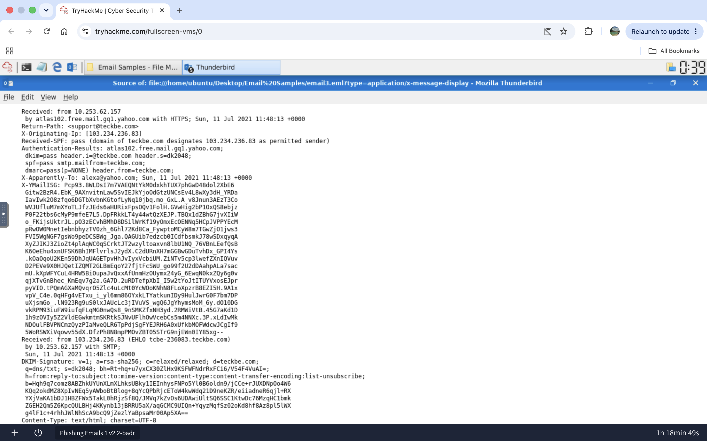
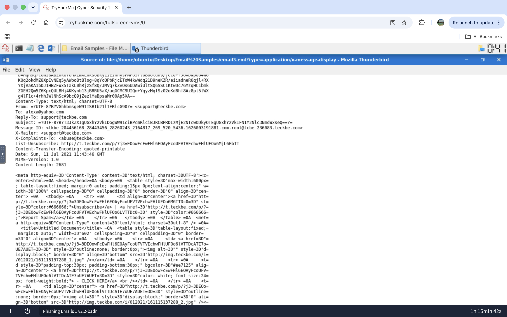
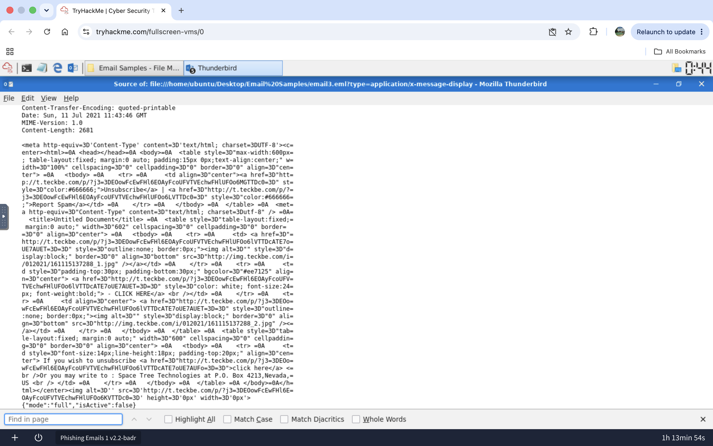

# Lab 013 - Email Structure and Header Analysis

## Executive Summary

This lab documents the static analysis of an email sample using Mozilla Thunderbird in a TryHackMe training environment.

The message presented itself as a Home Depot order notification, but the authenticated sender domain, mail infrastructure, and embedded links were associated with `teckbe.com`.

SPF, DKIM, and DMARC all passed. However, these results only confirmed that the message was authorised by `teckbe.com`; they did not confirm that the sender was authorised to represent Home Depot.

The email was assessed as suspicious because of the mismatch between the claimed brand and the authenticated domain. No confirmed credential theft, malware delivery, or successful compromise was identified.

---

## Objective

The objective of this lab was to understand the technical structure of an `.eml` file and practise reviewing:

- sender identity fields;
- SPF, DKIM, and DMARC results;
- the email delivery path;
- originating infrastructure;
- embedded links;
- remote images;
- tracking mechanisms.

The main analytical objective was to distinguish domain authentication from brand legitimacy.

---

## Environment / Training Context

Host: TryHackMe virtual machine  
Tool: Mozilla Thunderbird  
Data source: TryHackMe training `.eml` sample  
Sample: `email3.eml`  
Analysis type: Static header and HTML-source analysis  

The virtual machine and email sample were provided through TryHackMe.

The original `.eml` file and TryHackMe instructional content are not included in this repository. This report contains only my own observations, selected technical evidence, and conclusions.

---

## Evidence

### 1. Sender Authentication and Delivery Path

The message contained the following authentication results:

```text
SPF: pass
DKIM: pass
DMARC: pass
```

Relevant infrastructure fields included:

```text
Return-Path: support@teckbe.com
X-Originating-IP: 103.234.236.83
EHLO hostname: tcbe-236083.teckbe.com
```

The earliest visible external delivery hop showed:

```text
Received: from 103.234.236.83
(EHLO tcbe-236083.teckbe.com)
by 10.253.62.157 with SMTP
```



The evidence confirmed that the email was authorised and delivered through infrastructure associated with `teckbe.com`.

However, these authentication results did not establish that `teckbe.com` was authorised to represent Home Depot.

---

### 2. Sender Identity and Embedded Links

The sender-related fields included:

```text
From: Thank you! Home Depot <support@teckbe.com>
Reply-To: support@teckbe.com
Return-Path: support@teckbe.com
Message-ID: ...@tcbe-236083.teckbe.com
```

The technical sender fields were internally consistent with `teckbe.com`.

The visible identity, however, claimed to represent Home Depot.

The HTML body contained links and remote images using:

```text
hxxp://t[.]teckbe[.]com/...
hxxp://img[.]teckbe[.]com/...
```



The main `CLICK HERE` button did not point directly to an identifiable Home Depot domain. It used tracking or redirection infrastructure belonging to `teckbe.com`.

---

### 3. Tracking Pixel

The HTML source contained a zero-dimension image:

```text
height='0px'
width='0px'
```

Its source also used the sender's tracking infrastructure.



This was consistent with an invisible tracking pixel.

If remote content were enabled, the tracking request could potentially confirm that the email had been opened and expose information such as the opening time, public IP address, or email-client details.

Thunderbird blocked remote content during the analysis.

---

## Key Findings

| Category | Finding |
|---|---|
| Claimed brand | Home Depot |
| Technical sender | `support@teckbe.com` |
| Originating IP | `103.234.236.83` |
| EHLO hostname | `tcbe-236083.teckbe.com` |
| SPF | Pass |
| DKIM | Pass |
| DMARC | Pass |
| Main link domain | `t.teckbe.com` |
| Remote image domain | `img.teckbe.com` |
| Tracking pixel | Present |
| Brand-domain alignment | Inconsistent |
| Confirmed malware delivery | No |
| Confirmed credential theft | No |
| Confirmed compromise | No |

---

## Analysis

The email authenticated successfully as a message originating from `teckbe.com`.

The sender address, Reply-To address, Return-Path, Message-ID, SPF domain, DKIM domain, and embedded infrastructure were internally aligned. Therefore, the message did not appear to spoof the `teckbe.com` domain.

The suspicious element was the difference between the visible Home Depot identity and the authenticated `teckbe.com` domain.

This demonstrates an important email-analysis principle:

> SPF, DKIM, and DMARC can pass even when an email remains suspicious.

These controls confirm domain-level authentication. They do not confirm that the authenticated domain is authorised to represent another organisation.

The message also contained tracking or redirection links, remote images, a prominent call-to-action, and an invisible tracking pixel.

These findings increased suspicion, but the available static evidence did not confirm credential harvesting, malware delivery, or successful compromise.

No links were opened and no remote content was enabled during the investigation.

---

## Verdict

Classification: Suspicious email  
Confidence: Medium  
Possible brand impersonation: Yes  
Sender-address spoofing: Not observed  
Confirmed phishing: Not established  
Confirmed malware delivery: No  
Confirmed compromise: No  

The message was classified as suspicious because it presented itself as a Home Depot order notification while authenticating through unrelated `teckbe.com` infrastructure.

Further validation would be required before classifying the message as confirmed phishing.

---

## Recommended Next Steps

In a real SOC environment:

1. Verify whether `teckbe.com` is an authorised marketing or affiliate provider for Home Depot.
2. Analyse the embedded redirect URL in an approved sandbox.
3. Identify the final destination without opening the link on a production endpoint.
4. Search the email environment for similar messages.
5. Determine whether any recipients clicked the embedded links.
6. Review proxy, DNS, or endpoint telemetry for connections to the identified domains.
7. Quarantine the message if no legitimate relationship can be confirmed.
8. Escalate if credential harvesting, malware delivery, or fraudulent content is identified.

---

## Lessons Learned

- An `.eml` file contains technical evidence that is not visible in the standard email view.
- SPF, DKIM, and DMARC passing does not automatically make an email safe.
- Authentication validates the sending domain, not the legitimacy of the claimed brand.
- `Received` headers help reconstruct the email delivery path.
- Tracking links and remote images should not be opened directly during static analysis.
- Zero-dimension images may function as tracking pixels.
- Suspicious activity should not be overstated as confirmed malicious activity without sufficient evidence.
- Analyst conclusions should remain proportionate to the available evidence.
