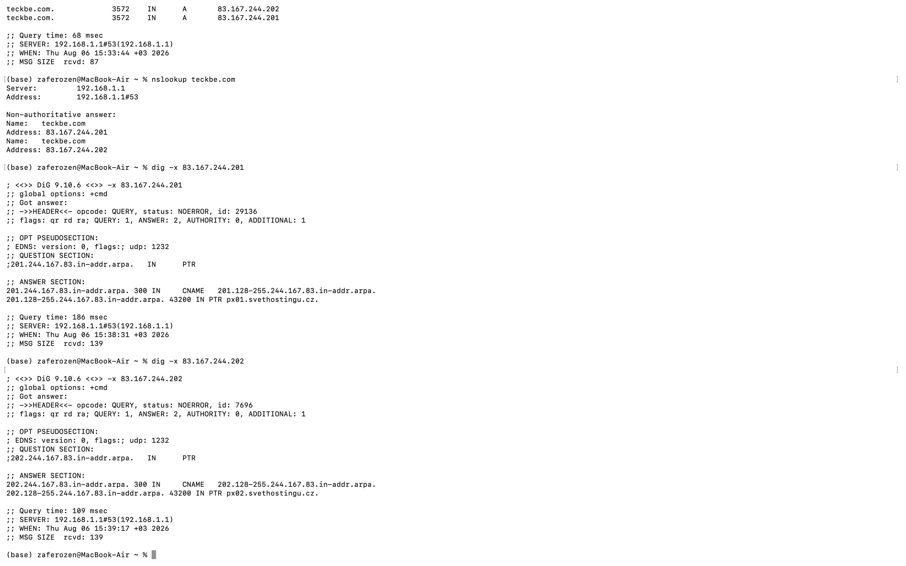
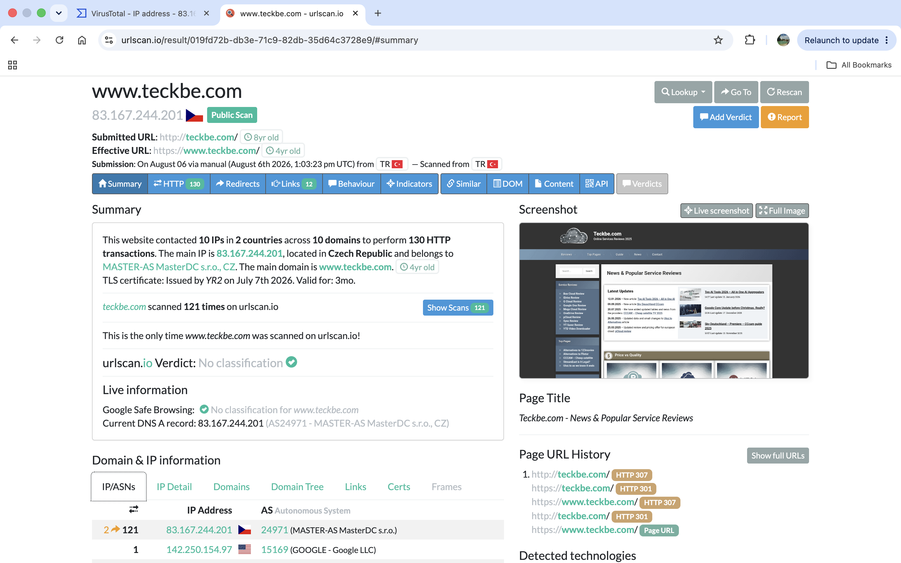
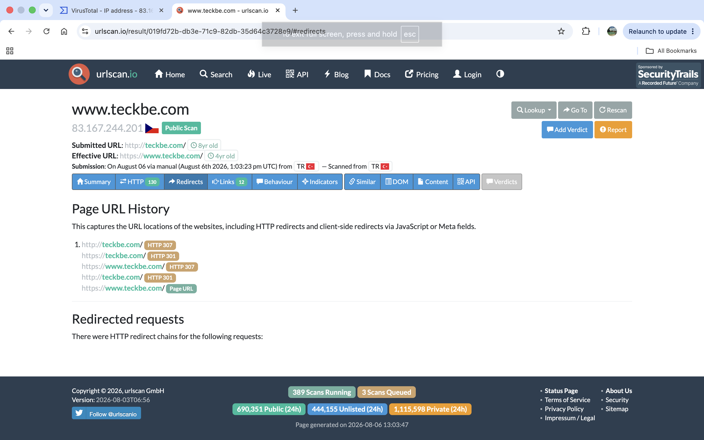

# Lab 015 - Suspicious URL and Domain Analysis

## Executive Summary 

This lab documents the investigation of a suspicious URL extracted during a phishing email analysis. The investigation focused on domain information, DNS records, reverse DNS analysis, hosting infrastructure, URLScan results, and HTTP redirect behavior.

The objective was to understand the infrastructure behind the suspicious URL and collect relevant indicators for further SOC investigation.

## Objective

The objective of this lab was to perform basic URL investigation techniques used during phishing triage:

- Identify domain and IP information
- Analyze DNS records
- Perform reverse DNS lookup
- Investigate hosting infrastructure
- Review URLScan results
- Analyze redirect behavior
- Collect potential indicators of compromise

## Environment / Data Source

Tools Used:

- VirusTotal
- URLScan.io
- DNS lookup tools
- Reverse DNS lookup tools

Investigation Type:

- Suspicious URL analysis
- Phishing investigation support

## Observed Activity

The suspicious URL was analyzed to identify associated infrastructure and web behavior.

The investigation identified:

- Domain information
- Associated IP address
- Hosting provider information
- DNS resolution details
- Reverse DNS information
- URLScan activity
- HTTP redirect chain

## Evidence

### Domain DNS Analysis

DNS analysis was performed to identify the relationship between the domain and its associated IP address.

### Reverse DNS Analysis

Reverse DNS lookup was performed to identify possible hostnames and infrastructure relationships.

### URLScan Analysis

URLScan was used to analyze website behavior, contacted IP addresses, domains, HTTP transactions, and infrastructure information.

### Redirect Chain Analysis

The URL was observed following multiple HTTP redirects before reaching the final destination.

## Analysis

The investigated URL showed characteristics commonly reviewed during phishing investigations, including redirect behavior and external infrastructure communication.

The associated IP address was identified as belonging to a hosting provider. Available reputation sources did not classify the infrastructure as malicious at the time of analysis.

However, because the URL originated from a phishing-related investigation, it should be treated as suspicious and correlated with additional indicators.

## Risk

Potential risks include:

- Redirecting users to malicious websites
- Tracking user activity
- Delivering phishing pages
- Collecting user credentials or sensitive information

## Recommended Next Steps

- Search SIEM logs for users accessing the URL
- Monitor related domains and IP addresses
- Enrich indicators using threat intelligence platforms
- Block confirmed malicious indicators
- Continue investigation if additional IOCs are discovered

## MITRE ATT&CK Mapping

Technique:

- T1566.002 - Phishing: Spearphishing Link

## Final SOC Summary

A suspicious URL extracted from a phishing investigation was analyzed through DNS lookup, reverse DNS analysis, URLScan enrichment, and redirect inspection. The investigation identified the related infrastructure and observed web behavior. Although no direct malicious classification was available, the URL required further monitoring due to its phishing context.

## Lessons Learned

This lab improved practical SOC investigation skills by demonstrating how analysts enrich suspicious URLs, identify infrastructure relationships, collect evidence, and document findings in an investigation report.
